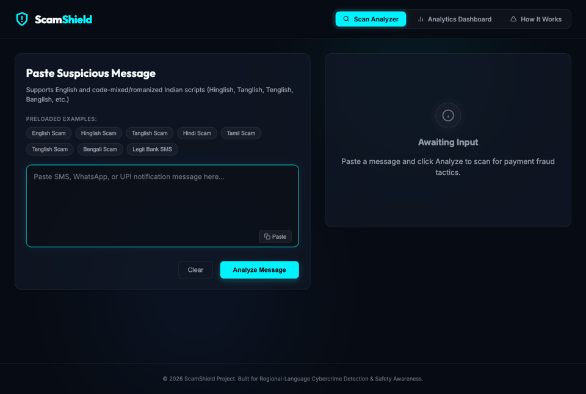

# 🛡️ ScamShield — Multilingual UPI/Payment Scam Detector with Explainable Tactics

> A real-time, explainable scam-detection system for India's most common financial fraud messages — built to understand **code-mixed regional languages** (Hinglish, Tanglish, Tenglish, Banglish, and more), not just English.

[](https://www.python.org/)
[](https://fastapi.tiangolo.com/)
[](https://scikit-learn.org/)
[](LICENSE)

---

## 🎯 The Problem

India processes over 15 billion UPI transactions a month — and alongside that volume comes a flood of payment scams via SMS and WhatsApp: fake KYC alerts, "you've won a prize" messages, fraudulent refund requests, and OTP-phishing attempts.

Most commercial spam/fraud filters are trained primarily on **English-language data from Western contexts**. They miss the specific phrasing patterns used in **code-mixed Indian languages** — messages that switch between English and Hindi, Tamil, Telugu, or Bengali mid-sentence, often in romanized script ("Unga account 30 nimishathula block aagidum...").

**ScamShield** closes that gap. It doesn't just say "this is a scam" — it explains **which manipulation tactic** is being used (urgency, fake authority, false rewards, credential phishing, etc.), in the language the message was written in, and works live over WhatsApp.

---

## ✨ Key Features

- **Binary scam classification** — TF-IDF + Logistic Regression pipeline, trained and evaluated with per-language/script breakdowns
- **Multi-label tactic detection** — identifies *why* a message is dangerous: urgency, authority impersonation, false reward, loss aversion, credential phishing, suspicious links
- **Evidence extraction** — highlights the exact phrase in the message that triggered each tactic flag
- **Multilingual by design** — extensible "language pack" architecture (JSON-based) currently covering English, Hindi/Hinglish, Tamil/Tanglish, Telugu/Tenglish, and Bengali/Banglish, with native-script and romanized variants
- **Rule-based language/script detection** — Unicode-range detection for native scripts + dictionary-based fuzzy matching for romanized text, with graceful fallback for unsupported languages
- **Live WhatsApp integration** — powered by Twilio's WhatsApp Sandbox; forward any suspicious message and get an instant analysis reply
- **Self-aware evaluation** — `metrics_report.md` documents exactly where the model performs well vs. poorly, broken down by language and script, including low-support warnings rather than misleading perfect scores
- **Feedback loop** — every analysis is logged to SQLite with a correction mechanism, designed to support future retraining

---

## 🌐 Live Demo

**Web App** — https://scamshield-ai-glhm.onrender.com/
**API Docs** — https://scamshield-ai-glhm.onrender.com/docs

The deployment is defined in `render.yaml`, whose build command downloads the
corpus and trains the production model, so a fresh deploy serves a working model
rather than "Models are not trained". Check which model is live with
`GET /api/health`.



*The demo: an English scam is flagged with a plain-language explanation, a real bank
notification passes, a Tanglish code-mixed message is detected as Tamil/romanized and
flagged, and the analytics dashboard shows the traffic split.*

---

## 🏗️ Architecture

```
                    ┌──────────────────────────────────────────┐
  WhatsApp / SMS ──▶│  FastAPI  (src/main.py)                  │
  (Twilio webhook)  │  · signature validation (on by default)  │
                    │  · CORS allowlist · rate limiter         │
                    └───────────────┬──────────────────────────┘
                                    │
                    ┌───────────────▼──────────────────────────┐
  Browser UI ──────▶│  src/inference.py                        │
  (static/)         │  script + language detector              │
                    │  model registry  (src/model_registry.py) │
                    └───────┬───────────────────┬──────────────┘
                            │                   │
              ┌─────────────▼──────┐   ┌────────▼─────────────────────┐
              │ ONNX int8 encoder   │   │ TF-IDF + logistic regression │
              │ XLM-R, 278 MB      │   │ fallback, 10 MB              │
              │ binary + 6 tactics │   │ binary + 6 tactics           │
              └─────────┬──────────┘   └────────┬────────────────────┘
                        │  6.1 ms p50, F1 0.998  │  1.95 ms p50, F1 0.920
                        └──────────┬──────────────┘
                                   │
                    ┌──────────────▼──────────────────────────┐
                    │  explanation builder (the message's own   │
                    │  language) + verbatim evidence spans    │
                    └───────────────┬──────────────────────────┘
                                    │
                    ┌───────────────▼──────────────────────────┐
                    │  SQLite: analysis log, user corrections,  │
                    │  score-distribution drift monitoring     │
                    └─────────────────────────────────────────┘
```

Data pipeline (Phase 1) and evaluation harness (Phases 2-4) are separate from the
request path:

```
sources ──▶ download (SHA-256) ──▶ build_dataset ──▶ train ──▶ export/quantise
             (licence per source)   (scrub, dedup,      │            │
                                     group-aware split) │            ▼
                                          │            │      evaluate_models
                                          ▼            │      evaluate_with_ci
                                   check_leakage ◀─────┘      evaluate_robustness
                                                                  benchmark_latency
```

### Detection Pipeline

1. **Script & Language Detection** (`detector.py`) — Unicode block ranges identify native scripts (Devanagari, Tamil, Telugu, Bengali, etc.); a fuzzy-matched dictionary of common transliterated words identifies romanized regional languages (Hinglish, Tanglish, Tenglish, Banglish). Falls back to `unsupported`/`ambiguous` gracefully.
2. **Binary Classification** (Model A) — TF-IDF (word + character n-grams) + Logistic Regression, calibrated for probability output.
3. **Multi-Label Tactic Classification** (Model B) — One-vs-rest TF-IDF + Logistic Regression per tactic category, with evidence spans extracted via top-weighted n-gram matching.
4. **Explanation Synthesis** — Template-based natural-language explanation combining the detected tactics and evidence.

---

## 🌐 Language Coverage

| Language | Native Script | Romanized | Status |
|---|---|---|---|
| English | — | ✅ | Production-ready |
| Hindi | ✅ Devanagari | ✅ Hinglish | Production-ready |
| Tamil | ✅ Tamil script | ✅ Tanglish | Production-ready |
| Telugu | ✅ Telugu script | ✅ Tenglish | Growing dataset |
| Bengali | ✅ Bengali script | ✅ Banglish | Growing dataset |
| Kannada, Malayalam, Gujarati, Punjabi, Odia | Script detection only | — | Roadmap (see `docs/adding_a_language.md`) |

Adding a new language requires **zero code changes** — just a new JSON language pack. See [`docs/adding_a_language.md`](docs/adding_a_language.md).

---

## 📊 Results

Every number below is produced by a script in this repository, and the command
that regenerates it is shown. Full method, per-language breakdown, confidence
intervals and limitations: [`docs/model_comparison.md`](docs/model_comparison.md).

### Production model, chosen on measurement

| Candidate | F1 (val) | CPU p50 | Size | Throughput | Verdict |
|---|---|---|---|---|---|
| **XLM-R + aug, ONNX int8** | **0.9980** | 6.1 ms | 278 MB | 85 msg/s | **Shipped** - best accuracy, 3 attacks at zero flips, fast enough to serve |
| XLM-R + aug, ONNX fp32 | 0.9980 | 6.2 ms | 1110 MB | - | Same accuracy, 4x the size for 0.1 ms: rejected |
| TF-IDF + LR (aug) | 0.9198 | 1.95 ms | 10 MB | 3160 msg/s | Kept as the fallback for size-constrained hosts |

ONNX Runtime was the surprise: it runs the encoder **5x faster** than PyTorch on
CPU (6.2 ms vs 31.9 ms p50) and int8 quantisation is free here (278 MB, identical
F1 0.9980, no measured accuracy cost). `python -m scripts.export_model --model
xlmr-base-aug --quantize` produces it; the API serves it by default and falls back
to TF-IDF if the artefact is missing.

**Validation split, 1,554 rows, threshold 0.5** —
`python -m scripts.evaluate_models --models tfidf-lr indicbertv2-mlm xlmr-base`

| Model | What it is | Precision | Recall | F1 | ROC-AUC | Tactic macro-F1 | Command |
|---|---|---|---|---|---|---|---|
| tfidf-lr | retrained baseline, TF-IDF + LR | 0.8522 | 0.9722 | 0.9082 | 0.9892 | 0.8254 | `python -m scripts.train_tfidf` |
| indicbertv2-mlm | IndicBERTv2 fine-tuned, 7 heads | 0.9980 | 0.9881 | 0.9930 | 1.0000 | 0.9621 | `python -m src.models.transformer --model ai4bharat/IndicBERTv2-MLM-only --config configs/indicbertv2.json` |
| xlmr-base | XLM-R base fine-tuned, 7 heads | 0.9941 | 1.0000 | 0.9970 | 0.9999 | 0.9267 | `python -m src.models.transformer --model xlm-roberta-base --config configs/xlmr.json` |

**Prompted and LoRA-tuned LLMs, on a 354-row seeded stratified subsample** (the
same rows for both, because generation is slow) —
`python -m scripts.evaluate_models --models llm-0shot llm-3shot --subsample 400`

| Model | What it is | Precision | Recall | F1 | Tactic macro-F1 | Command |
|---|---|---|---|---|---|---|
| llm-0shot | Qwen2.5-7B-Instruct-4bit, rules + JSON | 0.5329 | 0.9889 | 0.6926 | 0.0919 | `python -m src.models.llm_prompted --shots 0 --limit 400` |
| llm-3shot | same model, 3 examples | 0.5696 | 1.0000 | 0.7258 | 0.4030 | `python -m src.models.llm_prompted --shots 3 --limit 400` |
| lora-SmolLM2-135M | SmolLM2-135M + LoRA r=16, 1 epoch | 0.9597 | 0.7944 | 0.8693 | 0.1822 | `python -m src.models.lora --model HuggingFaceTB/SmolLM2-135M-Instruct --config configs/lora_smollm135m.json --device cpu` |

The prompted LLM flags 334 of 354 messages as scam (316 of 354 with three
examples): a prompted model learns the *topic* of fraud detection, not the decision
boundary. **Fine-tuning a 135M model - 50x smaller than the 7B it is compared
against - reaches F1 0.869 at precision 0.96**, because the answer token it is
trained to emit carries the corpus prior instead of the prompt's prior. For an
imbalanced detection task, fine-tuning a small model beats prompting a large one.

**Confidence intervals and calibration** —
`python -m scripts.evaluate_with_ci --models tfidf-lr indicbertv2-mlm xlmr-base`

| Model | F1 (95% CI, 2,000 bootstrap) | Macro F1 over cells | Brier | ECE |
|---|---|---|---|---|
| tfidf-lr | 0.9082 (0.889 - 0.926) | 0.9277 | 0.0495 | 0.0631 |
| indicbertv2-mlm | 0.9930 (0.987 - 0.998) | 0.9972 | 0.0040 | 0.0059 |
| xlmr-base | 0.9970 (0.993 - 1.000) | 0.9965 | 0.0023 | 0.0037 |

**Robustness under attack** — a filter is attacked by construction.
`python -m scripts.evaluate_robustness --models tfidf-lr tfidf-lr-aug xlmr-base xlmr-base-aug`

F1 under six perturbation families (leetspeak, look-alike characters, transliteration
drift, spacing tricks, emoji injection, disguised links), with the change from clean in
brackets. Full method and caveats: [`docs/robustness.md`](docs/robustness.md).

| Model | Clean F1 | char_swap | lookalike | spacing | mean flip rate |
|---|---|---|---|---|---|
| tfidf-lr | 0.9082 | 0.863 (-0.045) | 0.884 (-0.024) | 0.886 (-0.022) | 0.017 |
| tfidf-lr-aug | 0.9198 | 0.902 (-0.018) | 0.909 (-0.011) | 0.911 (-0.009) | 0.015 |
| xlmr-base | 0.9970 | 0.964 (-0.033) | 0.977 (-0.020) | 0.971 (-0.026) | 0.011 |
| **xlmr-base-aug** | **0.9980** | **0.993 (-0.005)** | 0.986 (-0.012) | 0.985 (-0.013) | **0.003** |

Leetspeak is the attack that bites, and the model that wins on clean text is not
automatically the most robust: the un-augmented IndicBERTv2 loses 0.083 F1 to
character swaps. Training on perturbed text made the models both more robust and
slightly more accurate, at **no inference cost** — the augmented baseline runs at
1.95 ms p50 versus 1.96 ms un-augmented, same 10.2 MB artefact.

**Cost of a mistake.** Treating a missed scam as 10x a false alarm, the
cost-optimal threshold is 0.30 for the baseline (from 0.45 at best-F1) and 0.45 for
XLM-R, where the choice does not matter. The full 0.05-0.95 sweep is in
`results/evaluation_with_ci.json`.

**Latency on CPU, 100 messages** —
`python -m scripts.benchmark_latency --models tfidf-lr indicbertv2-mlm xlmr-base --n 100 --device cpu`

| Model | p50 | p95 | Throughput | Artefact |
|---|---|---|---|---|
| tfidf-lr | 2.31 ms | 4.00 ms | 389 msg/s | 10.2 MB |
| indicbertv2-mlm | 38.67 ms | 134.74 ms | 20.6 msg/s | 1120 MB |
| xlmr-base | 31.89 ms | 82.70 ms | 26.3 msg/s | 1129 MB |

The prompted 7B LLM costs about $0.004 and 60 minutes per 1,000 messages on
local hardware, or $0.14 per 1,000 via a hosted API at a blended $0.30/1M tokens
(`python -m scripts.llm_cost --shots 3`).

> **What these numbers do and do not mean.** They are **validation** numbers on a corpus
> that is still mostly synthetic. The hand-verified real-message test set is not frozen yet,
> so no number here measures the product on real traffic. The weak spot the breakdown does
> surface: the baseline scores 0.652 F1 on Bengali native (precision 0.48) - it flags most
> legitimate Bengali messages as scams, an error invisible in the aggregate.

---

## 🗂️ Data and the hand-verified test set

ScamShield separates three things that are easy to confuse:

- **Training data** — licence-checked corpora, template packs, and (training-only) LLM-written
  synthetic messages. Sources, licences and provenance: [`docs/data_sources.md`](docs/data_sources.md).
- **The hand-verified test set** — **real** messages only, labelled by a human against
  [`docs/labeling_guidelines.md`](docs/labeling_guidelines.md), never used for training or
  threshold tuning. Composition and gaps: `docs/test_set.md`.
- **Synthetic data** — LLM-generated, always marked, and **never** allowed in the test set.

Build the corpus and prove it is clean:

```bash
python -m scripts.download_data        # fetch sources, SHA-256 pinned
python -m scripts.build_dataset           # PII scrub, dedup, near-dup-aware train/val split
python -m scripts.check_leakage           # no message appears (even near-duplicated) across splits
```

Prepare the test candidate pool, and help fill the languages that have no public corpus:

```bash
python -m scripts.make_test_candidates    # unlabelled, real-only candidates
python -m scripts.import_user_messages --input my_messages.csv   # add your own real messages
```

Label with `docs/labeling/labeler.html` (opens in a browser, works offline), export
`labels.jsonl`, then freeze the set:

```bash
python -m scripts.freeze_test             # -> data/processed/test.jsonl + docs/test_set.md
```

> **Honest limitation:** the only licence-clean, real, labelled scam corpus available for this
> task is the UCI SMS Spam Collection, which is **English**. For Hindi, Tamil, Telugu and
> Bengali there is no public real corpus, so those test cells are filled from messages the
> owner supplies. This gap is documented rather than papered over with synthetic data.

---

## 📊 Evaluation

The current production model (TF-IDF + logistic regression) is trained and evaluated on the
template-generated corpus described in [`docs/data_sources.md`](docs/data_sources.md). Its
metrics are written to `models/metrics_report.md` on every `python -m src.train` run, with a
per-language and per-script breakdown and low-support warnings.

**Know what the numbers mean.** The legacy corpus expands a small set of hand-written
templates with random placeholders, and the model is evaluated on held-out samples drawn from
those same templates. That measures template memorisation, not real-world accuracy — which is
exactly why the project now separates a licence-checked corpus and a hand-verified test set
from the training data.

The reproducible data pipeline is the source of truth for evaluation going forward:

```bash
python -m scripts.download_data      # fetch licence-checked sources, pinned by SHA-256
python -m scripts.build_dataset         # scrub, dedup, near-dup-aware split -> data/processed/
python -m scripts.check_leakage         # prove no message leaks across splits
```

Every figure quoted in this README comes from a script in this repository, with the exact
command shown next to it. See [`docs/data_card.md`](docs/data_card.md) for what is in the
corpus, what is real vs. synthetic vs. unverified, and the known biases.

---

## 🚀 Getting Started

### Prerequisites
- Python 3.10+
- pip

### Installation

```bash
git clone https://github.com/pavan-dangeti/ScamShield-AI.git
cd ScamShield-AI
pip install -r requirements.txt
cp .env.example .env
```

### Generate the dataset and train the models

```bash
python scripts/dataset_generator.py
python -m src.train
```

This produces `data/scam_dataset.csv`, the trained model artifacts in `models/`, and `models/metrics_report.md`.

> This is the original template-based pipeline, kept so the current production model still
> trains. The licence-checked corpus and its hand-verified test set are built separately —
> see [`docs/data_sources.md`](docs/data_sources.md) and
> [`docs/data_card.md`](docs/data_card.md) for `python -m scripts.download_data`,
> `python -m scripts.build_dataset` and `python -m scripts.check_leakage`.

### Run the server

```bash
python -m src.main
```

Visit `http://127.0.0.1:8000` for the web dashboard, or `http://127.0.0.1:8000/docs` for the interactive API documentation.

### (Optional) Connect a live WhatsApp number

See [`docs/twilio_setup.md`](docs/twilio_setup.md) for the full Twilio Sandbox + ngrok setup — takes about 10 minutes and is completely free.

---

## 🔌 API Reference

| Endpoint | Method | Description |
|---|---|---|
| `/api/analyze` | POST | Analyze a message; returns scam probability, language/script, detected tactics with evidence, and a plain-language explanation |
| `/api/sms-webhook` | POST | Twilio webhook for WhatsApp/SMS — auto-replies with an analysis summary |
| `/api/feedback` | POST | Submit a correction for a previously analyzed message |
| `/api/stats` | GET | Aggregate statistics: tactic frequency, language distribution, web vs. messaging traffic |

Example request:

```bash
curl -X POST http://127.0.0.1:8000/api/analyze \
  -H "Content-Type: application/json" \
  -d '{"text": "Unga account 30 nimishathula block aagidum, ippo click pannunga: bit.ly/xyz"}'
```

---

## 📁 Project Structure

```
scamshield/
├── data/
│   ├── language_packs/        # Per-language scam/legit templates (extensible)
│   ├── raw/                   # downloaded sources (not committed, re-fetched by script)
│   ├── processed/             # built train/val (+ frozen test) splits (not committed)
│   ├── synthetic/             # locally generated, training-only messages
│   ├── test_candidates/       # unlabelled pool for the hand-verified test set
│   └── scam_dataset.csv       # legacy template dataset (kept for the current model)
├── docs/
│   ├── data_sources.md        # every source: licence, provenance, eligibility
│   ├── data_card.md           # corpus composition, biases, limitations
│   ├── labeling_guidelines.md # scam vs legit rules + per-tactic definitions
│   ├── labeling/labeler.html  # keyboard-driven test-set labelling tool
│   ├── adding_a_language.md
│   └── twilio_setup.md
├── models/
│   ├── binary_classifier.pkl
│   ├── tactic_classifier.pkl
│   ├── vectorizers.pkl
│   └── metrics_report.md
├── scripts/
│   ├── download_data.py       # fetch licence-checked sources (SHA-256 pinned)
│   ├── build_dataset.py       # scrub, dedup, near-dup-aware train/val split
│   ├── check_leakage.py       # prove no leakage across splits
│   ├── generate_synthetic.py  # LLM-written training data (training only)
│   ├── make_test_candidates.py# assemble the unlabelled test candidate pool
│   ├── import_user_messages.py# import owner-contributed real messages
│   ├── freeze_test.py         # freeze hand-verified test set + write docs/test_set.md
│   ├── scrub_pii.py           # PII scrubbing
│   └── dataset_generator.py   # legacy template expansion
├── src/
│   ├── detector.py             # Script/language detection
│   ├── train.py                # Training + evaluation
│   ├── inference.py            # Prediction + explanation logic
│   ├── taxonomy.py             # manipulation-tactic taxonomy (single source of truth)
│   ├── database.py             # SQLite logging
│   └── main.py                 # FastAPI app
├── tests/                      # data-pipeline + integration tests
└── static/                     # Web dashboard (HTML/CSS/JS)
```

---
## 📸 Screenshots

### 🏠 Homepage


---

### 🔍 Scam Detection


---

### 📊 Analytics Dashboard


---

### 📖 API Documentation


---

### 📱 WhatsApp Integration


---

## 🔭 Limitations

These are the limitations the measured numbers actually show, not a wish list.

1. **Every accuracy number is a validation number.** The hand-verified
   real-message test set is **not frozen**: 189 English candidates are labelled
   and waiting, and the eight Indic cells have no public real corpus. Until the
   owner labels them and `python -m scripts.freeze_test` runs, nothing in this
   README measures the product on real traffic. This is the single biggest gap.
2. **The corpus is mostly synthetic or of unstated provenance.** 4,904 real rows
   (UCI, English, UK, 2004-2011), 6,855 Bengali rows from a corpus that does not
   state how it was collected, 2,180 template rows, 1,538 synthetic rows. See
   [`docs/data_card.md`](docs/data_card.md).
3. **Bengali is 37% of the corpus** from that unverified source, so per-language
   results over-represent Bengali relative to real traffic. Telugu and Tamil
   cells have 24-38 validation rows, wide enough that their individual numbers
   mean little.
4. **Tactic explanations are weaker than the decision.** Tactic labels are
   template-derived, so tactic metrics measure "which template family is this".
   A contextual encoder cannot attribute a verbatim evidence span, so it reports
   generic phrasing rather than inventing a quote.
5. **The explanations are English-only**, even when the message is not.
6. **Adversarial coverage is six static families.** No adaptive (EOT /
   gradient-guided) attack was run, and robustness to a seventh family is
   untested.
7. **The prompted-LLM arm over-flags** (334 of 354 messages called scam), which is
   reported rather than tuned away; fine-tuning is what fixes it.
8. **Single-rater labelling.** There is no second labeller, so the inter-rater
   agreement check in `docs/labeling_guidelines.md` cannot be run.
9. **English-only real data means the real-data rows are UK banking and carrier
   messages.** Expect over-flagging of legitimate Indian marketing the model has
   not seen.

**Planned:** Kannada, Malayalam, Gujarati, Punjabi and Odia language packs;
multilingual explanations; a frozen, published test set.

---

## 🧠 Why This Project

This started as an exploration of a real, underexplored gap: most fraud-detection systems are evaluated almost entirely in English, despite the fact that hundreds of millions of users in India communicate — and get scammed — in code-mixed regional languages. ScamShield is an attempt to build a system that is honest about *where it works and where it doesn't*, rather than optimizing for a single headline accuracy number.

---

## 📄 License

MIT
