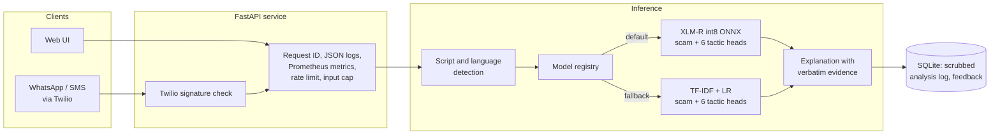
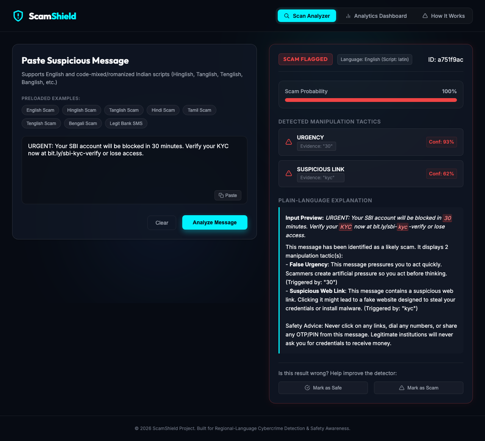
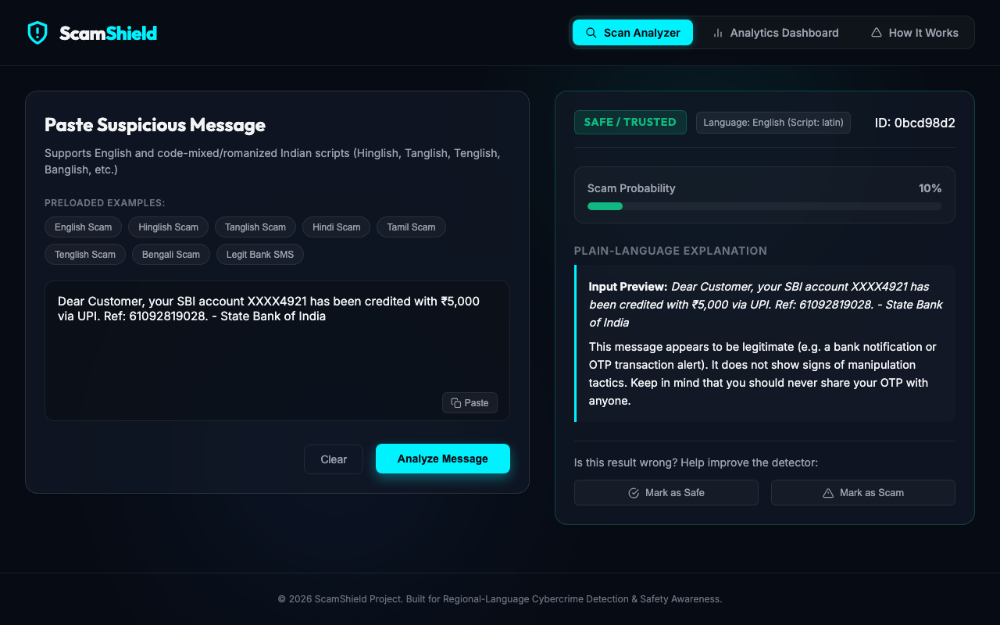
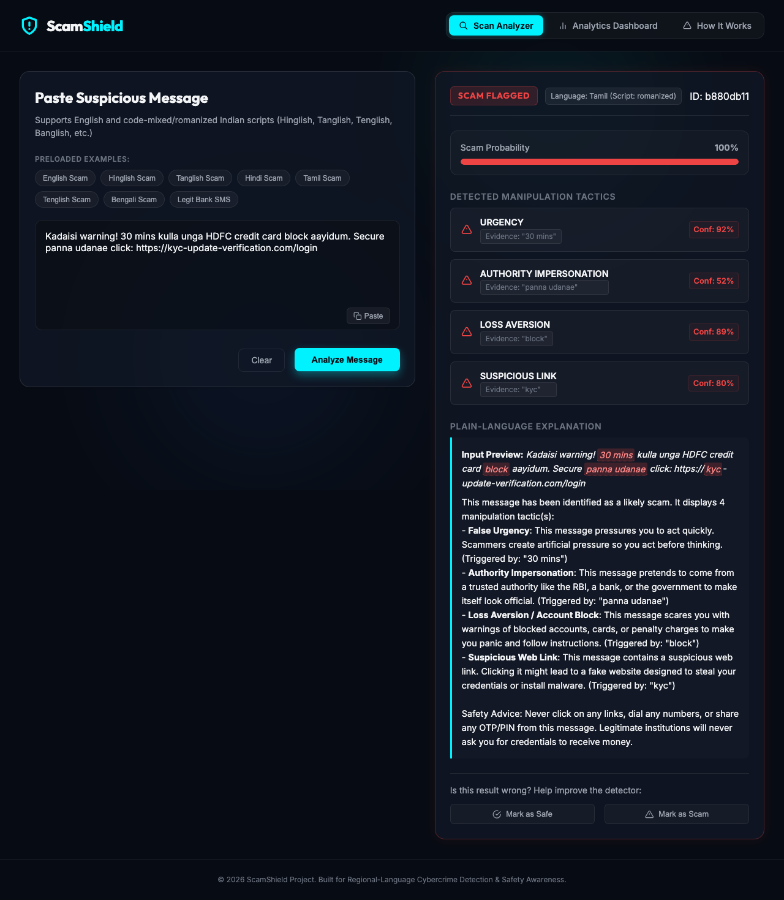
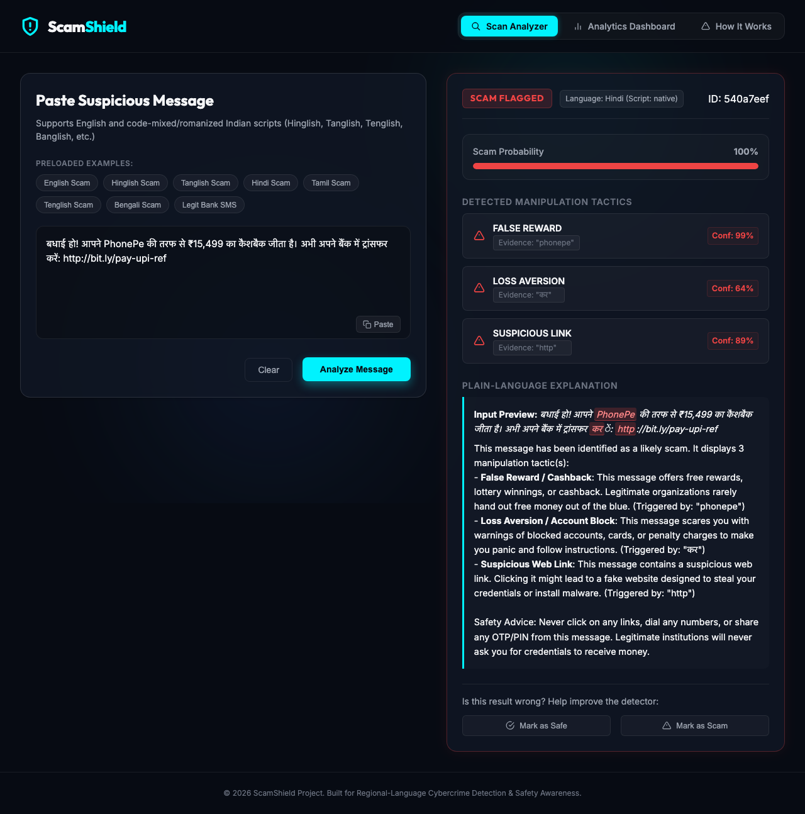
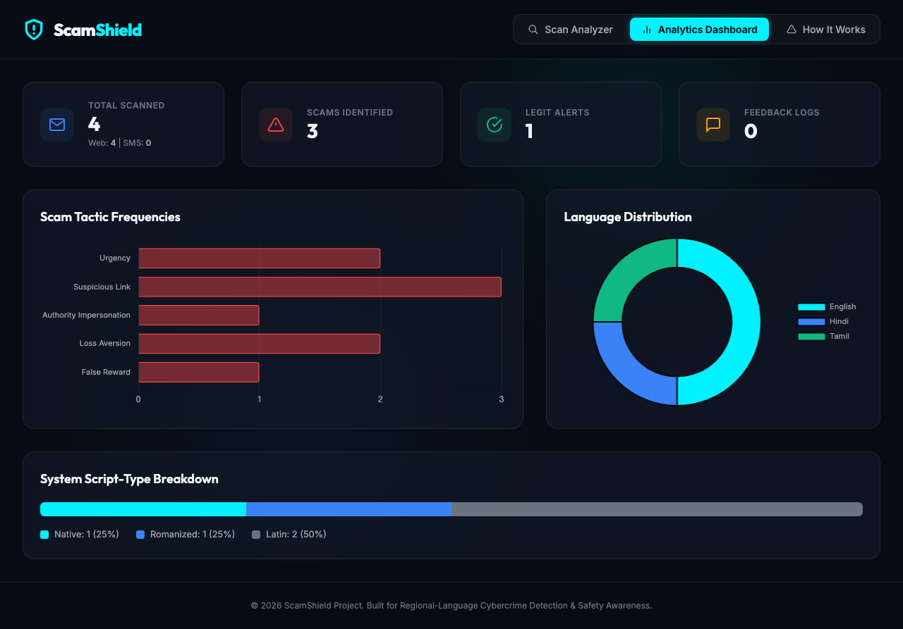
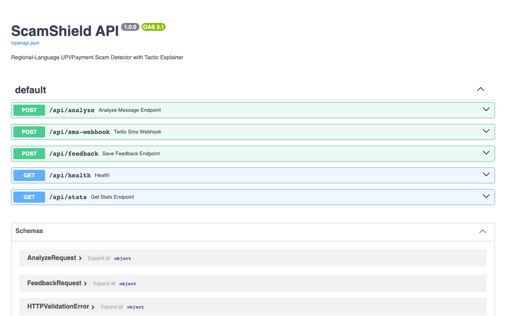

# ScamShield

ScamShield classifies SMS and WhatsApp messages as payment scams or legitimate, and
names the manipulation tactics a scam uses. It is built for Indian traffic, where
messages mix English with Hindi, Tamil, Telugu or Bengali, often in Latin script
("Unga account block aagidum, ippo click pannunga"), which English-trained filters
handle poorly.

[Live demo](https://scamshield-ai-glhm.onrender.com) ·
[API reference](https://scamshield-ai-glhm.onrender.com/docs) ·
[Design document](docs/design.md) ·
[Model on Hugging Face](https://huggingface.co/pavan-dangeti/scamshield-xlmr-int8) ·
[Model card](docs/model_card.md) ·
[Data card](docs/data_card.md)

[](https://github.com/pavan-dangeti/ScamShield-AI/actions/workflows/ci.yml)
[](LICENSE)


[Watch the demo as video (MP4, 40 s)](docs/demo/scamshield_demo.mp4) · [Screenshots](#screenshots)

> **Status.** All accuracy figures below are measured on a held-out validation split
> of a corpus that is largely synthetic or of unverified provenance. A hand-labelled
> test set of real messages is in progress. Until it is frozen, treat these numbers as
> evidence about the method, not about performance on real traffic.

## Summary

| | Best model: XLM-R, fine-tuned with adversarial augmentation | Baseline: TF-IDF + logistic regression |
|---|---|---|
| Scam F1, validation (95% CI) | **0.9980** (0.995–1.000) | 0.9082 (0.889–0.926) |
| F1 under character-swap attack | **0.993** | 0.863 |
| CPU latency p50, one message | 4.44 ms (int8 ONNX) | **0.51 ms** |
| Artefact size | 278 MB | **10.2 MB** |
| Server memory with model loaded | ~1.1 GB | **fits in 512 MB** |

The encoder is the better model; the baseline is the cheaper one. The API loads the
encoder by default and falls back to the baseline when the artefact is absent. The
public demo runs the baseline because its host provides 512 MB of memory.
`GET /api/health` reports which model is serving.

Every figure in this README is produced by a script in the repository, the result files
are committed under `results/`, and `tests/test_docs_honesty.py` fails CI if the README
drifts from them.

## Architecture



**Request path.** Native scripts are identified by Unicode range and romanised
code-mixing by exact matches against per-language word lists. A single model produces
the scam probability and six multi-label tactic scores (urgency, authority
impersonation, false reward, loss aversion, credential phishing, suspicious link), so
the explanation cannot contradict the decision. Evidence is quoted only when it appears
verbatim in the message. The analysis is logged with personal identifiers removed; a
logging failure never fails the request.

**Offline pipeline.** `download_data` (sources pinned by SHA-256, licence recorded per
source) → `build_dataset` (PII scrubbing, de-duplication, near-duplicate-aware split) →
`check_leakage` → training → `evaluate_models`, `evaluate_with_ci`,
`evaluate_robustness`, `benchmark_latency` → `export_model` (ONNX, int8).

## Key decisions

| Decision | Chosen | Rejected | Reason | Evidence |
|---|---|---|---|---|
| Train/validation split | By near-duplicate group | Random rows | Template-generated text leaks across a random split and inflates F1 | `scripts/check_leakage.py` |
| Production model | Fine-tuned XLM-R | Prompted 7B LLM | The prompted model labels 334 of 354 messages scam zero-shot and 316 with three examples; best F1 0.726 | `results/model_comparison_subsample400.md` |
| Small-model alternative | LoRA fine-tune of a 135M model | Prompting | F1 0.869 at 50× fewer parameters than the 7B | same |
| Robustness | Adversarial augmentation in training | Input normalisation at inference | Changes the model rather than adding a reversible layer; no latency cost | `results/robustness.md` |
| Serving format | ONNX Runtime, int8 | PyTorch fp32 | 2.6× faster and 4× smaller with no measured F1 loss | `results/latency.json`, `results/export.json` |
| Explanation evidence | Verbatim substrings only | Highest-weight n-gram | Rebuilt n-grams can quote text the sender never wrote | `docs/robustness.md` |
| Scaling | Worker processes | Threads, batching | Inference is CPU-bound; batching lowers CPU throughput through padding | `results/load_test_*` |

Alternatives, risks and what would change the design are in
[`docs/design.md`](docs/design.md).

## Evaluation

All models are scored on the same 1,554-message validation split at threshold 0.5.

| Model | Precision | Recall | F1 | ROC-AUC | Tactic macro-F1 | CPU p50 | Size |
|---|---|---|---|---|---|---|---|
| TF-IDF + LR | 0.8522 | 0.9722 | 0.9082 | 0.9892 | 0.8254 | 0.51 ms | 10.2 MB |
| TF-IDF + LR, augmented | 0.8589 | 0.9901 | 0.9198 | 0.9884 | 0.8891 | 0.52 ms | 16.6 MB |
| IndicBERTv2, fine-tuned | 0.9980 | 0.9881 | 0.9930 | 1.0000 | 0.9621 | 11.73 ms | 1120 MB |
| XLM-R base, fine-tuned | 0.9941 | 1.0000 | 0.9970 | 0.9999 | 0.9267 | 11.71 ms | 1129 MB |
| XLM-R base, augmented | 0.9960 | 1.0000 | **0.9980** | 0.9996 | **0.9871** | 4.44 ms (int8) | 278 MB |

```bash
python -m scripts.evaluate_models --models tfidf-lr tfidf-lr-aug indicbertv2-mlm xlmr-base xlmr-base-aug
python -m scripts.benchmark_latency --models tfidf-lr tfidf-lr-aug indicbertv2-mlm xlmr-base xlmr-aug-fp32 xlmr-aug-int8 --n 200 --device cpu
```

<details>
<summary><b>LLM approaches</b> (354-message seeded subsample, because generation is slow)</summary>

| Model | Precision | Recall | F1 | Tactic macro-F1 |
|---|---|---|---|---|
| Qwen2.5-7B-Instruct, 4-bit, zero-shot | 0.5329 | 0.9889 | 0.6926 | 0.0919 |
| Qwen2.5-7B-Instruct, 4-bit, 3-shot | 0.5696 | 1.0000 | 0.7258 | 0.4030 |
| SmolLM2-135M + LoRA (r=16, 1 epoch) | 0.9597 | 0.7944 | 0.8693 | 0.1822 |

```bash
python -m scripts.evaluate_models --models llm-0shot llm-3shot lora-SmolLM2-135M-Instruct --subsample 400
python -m scripts.llm_cost --shots 3
```

The prompted model learns the topic, not the decision boundary, and over-flags.
Prompting costs about $0.004 and 60 minutes per 1,000 messages on a laptop, or $0.14
per 1,000 through an API at $0.30 per million tokens.
</details>

<details>
<summary><b>Confidence intervals, calibration and threshold choice</b></summary>

| Model | F1 (95% CI, 2,000 bootstrap samples) | Macro F1 over language/script cells | Brier | ECE |
|---|---|---|---|---|
| TF-IDF + LR | 0.9082 (0.889–0.926) | 0.9277 | 0.0495 | 0.0631 |
| TF-IDF + LR, augmented | 0.9198 (0.903–0.937) | 0.9521 | 0.0514 | 0.0690 |
| XLM-R base, augmented | 0.9980 (0.995–1.000) | 0.9992 | 0.0010 | 0.0016 |

```bash
python -m scripts.evaluate_with_ci --models tfidf-lr indicbertv2-mlm xlmr-base
python -m scripts.evaluate_with_ci --models tfidf-lr-aug xlmr-base-aug --out results/evaluation_with_ci_aug.json
```

The threshold is chosen by expected cost, not F1. Weighting a missed scam at 10× a
false alarm moves the baseline's threshold from 0.45 (best F1) to **0.30**; for the
augmented XLM-R the cost-optimal and best-F1 thresholds coincide at 0.75. The full
sweep is in `results/evaluation_with_ci*.json` and the reasoning in
[`docs/model_comparison.md`](docs/model_comparison.md).

Aggregates hide a failure: on native-script Bengali (192 messages) the baseline
scores F1 0.652 at precision 0.48, flagging most legitimate messages. The encoders
score 1.0 on that cell.
</details>

## Robustness

Scam text is adversarial by construction. Six perturbation families are applied to the
validation split; the three that matter are shown (full table: `results/robustness.md`).

| Model | Clean F1 | Character swaps | Look-alike characters | Spacing | Mean flip rate |
|---|---|---|---|---|---|
| TF-IDF + LR | 0.9082 | 0.863 (−0.045) | 0.884 (−0.024) | 0.886 (−0.022) | 0.017 |
| TF-IDF + LR, augmented | 0.9198 | 0.902 (−0.018) | 0.909 (−0.011) | 0.911 (−0.009) | 0.008 |
| XLM-R base | 0.9970 | 0.964 (−0.033) | 0.977 (−0.020) | 0.971 (−0.026) | 0.011 |
| XLM-R base, augmented | 0.9980 | 0.993 (−0.005) | 0.986 (−0.012) | 0.985 (−0.013) | 0.003 |

```bash
python -m scripts.evaluate_robustness --models tfidf-lr tfidf-lr-aug xlmr-base xlmr-base-aug
```

Transliteration drift, emoji insertion and disguised links cost at most 0.009 F1.
Augmentation improved both robustness and clean accuracy at no latency cost; the
baseline artefact grows from 10.2 to 16.6 MB. Method and caveats:
[`docs/robustness.md`](docs/robustness.md).

## Operations

**Capacity.** HTTP load test against a local server, generator on the same 10-core
arm64 machine, so figures are lower bounds. Each report records the exact commands.

| Configuration | Concurrent clients | Requests/s | p50 | p95 | Errors |
|---|---|---|---|---|---|
| TF-IDF, 1 worker | 8 | 823 | 4.6 ms | 23.9 ms | 0% |
| TF-IDF, 4 workers | 8 | 1,250 | 3.2 ms | 21.3 ms | 0% |
| XLM-R int8, 1 worker | 8 | 388 | 19.3 ms | 33.6 ms | 0% |

```bash
RATE_LIMIT_PER_MINUTE=1000000 SCAMSHIELD_MODEL=tfidf-lr uvicorn src.main:app --port 8000 --workers 1
python -m scripts.load_test --serve --url http://127.0.0.1:8000/api/analyze --n 3000 --concurrency 1 8 32
```

Profiling under load showed the baseline vectorising each message seven times and
rebuilding its vocabulary on every evidence lookup. Fixing both raised single-worker
throughput from 161 to 823 requests/s with byte-identical predictions.

**Failure modes.** Each is induced deliberately in `tests/test_api.py`.

| Failure | Behaviour |
|---|---|
| Model raises | 500 with a generic message and request ID; cause logged, never returned |
| Model artefact missing or corrupt | Falls back to the baseline; `/api/health` reports it |
| Database unavailable | Analysis still returned; failure logged and counted |
| Oversized, empty or malformed input | 422 before inference |
| Client over rate limit | 429 |
| Missing or forged Twilio signature | 403 |
| Model fails inside the webhook | 200 with a valid TwiML apology, so Twilio does not retry |

**Observability.** One JSON log line per event, each carrying a request ID that is
also returned as `X-Request-ID`; message text is never logged. Prometheus metrics at
`/metrics` cover request rate and latency per route, predictions by language and
script, database errors, the loaded model, and the live score distribution that
`python -m scripts.monitor_drift` compares against a stored reference.

**Privacy.** Phone numbers, email addresses, UPI handles and long identifiers are
removed before a message is stored. Datasets are downloaded by script and never
committed.

## Data

| Provenance | Rows | Source | Use |
|---|---|---|---|
| Real | 4,904 | UCI SMS Spam Collection (English, CC BY 4.0) | train, validation, test candidates |
| Unverified | 6,855 | Public Bengali smishing corpus; collection method not stated | train, validation |
| Template | 2,180 | Per-language packs in `data/language_packs/` | train, validation |
| Synthetic | 1,538 | LLM-generated, quality-gated, marked | train only |

15,477 rows after scrubbing and de-duplication, split 13,923 / 1,554 with no
near-duplicate crossing the split. The test set admits real messages only. It is
labelled blind against [written guidelines](docs/labeling_guidelines.md), and its label
quality is measured by a blind re-check and by agreement with the original UCI
annotation. No public real corpus exists for Hindi, Tamil, Telugu or Bengali, so those
test cells depend on contributed messages. Details: [`docs/data_card.md`](docs/data_card.md).

**Built with Qwen.** 85 training rows were generated with Qwen2.5-3B-Instruct, which is
licensed under the Qwen Research License Agreement. Both the baseline and the published
encoder are trained on them.

## Getting started

```bash
git clone https://github.com/pavan-dangeti/ScamShield-AI.git && cd ScamShield-AI
python -m venv .venv && source .venv/bin/activate
pip install -r requirements-dev.txt && cp .env.example .env

python -m scripts.download_data && python -m scripts.build_dataset && python -m scripts.train_tfidf
SCAMSHIELD_MODEL=tfidf-lr python -m src.main          # http://127.0.0.1:8000
```

Quality gates, as run in CI:

```bash
pytest tests/ -q
ruff check src scripts tests
vulture src scripts tests --min-confidence 80
mypy --explicit-package-bases --namespace-packages src scripts tests
```

### Serving the fine-tuned model

The int8 XLM-R model is published at
[pavan-dangeti/scamshield-xlmr-int8](https://huggingface.co/pavan-dangeti/scamshield-xlmr-int8) (CC BY-NC 4.0, with its own model card);
`configs/model_hub.json` pins that repository, the exact revision and a SHA-256
checksum for every file.

```bash
pip install -r requirements-onnx.txt     # onnxruntime + tokenizer, no torch
python -m scripts.download_model         # 295 MB, every file verified
SCAMSHIELD_MODEL=xlmr-aug-int8 python -m src.main
```

If the files are missing when the server starts, it downloads and verifies them itself.
A mismatched or truncated file is rejected, and without `requirements-onnx.txt`
installed the server logs a warning and serves the baseline. Expect about 1.1 GB of memory.

To regenerate the model instead, run the "Reproduce the published int8 model" cells of
the [Colab notebook](notebooks/train_encoder_colab.ipynb) on a free T4 (or the same
commands locally with `requirements-ml.txt`), unzip the four files into `models/onnx/`,
and publish with `python -m scripts.publish_model --new-artefact`.

Other neural models need `requirements-ml.txt`; training commands are in
[`docs/model_comparison.md`](docs/model_comparison.md). WhatsApp setup:
[`docs/twilio_setup.md`](docs/twilio_setup.md). Adding a language:
[`docs/adding_a_language.md`](docs/adding_a_language.md). The demo above is recorded by
`python -m scripts.record_demo`.

| Endpoint | Method | Purpose |
|---|---|---|
| `/api/analyze` | POST | Scam probability, label, language and script, tactics with evidence, explanation |
| `/api/sms-webhook` | POST | Twilio webhook for WhatsApp and SMS; replies in TwiML |
| `/api/feedback` | POST | Record a user correction for an analysed message |
| `/api/stats` | GET | Dashboard aggregates |
| `/api/health` | GET | Liveness and the model currently serving |
| `/metrics` | GET | Prometheus metrics |

## Screenshots

Captured from the running application by `scripts/record_demo.py` in the same session
as the demo video.

| Scam in English: tactics, evidence and explanation | Legitimate bank alert |
|---|---|
|  |  |
| **Romanised Tamil (Tanglish) scam** | **Hindi scam in Devanagari** |
|  |  |
| **Analytics dashboard** | **Interactive API reference** |
|  |  |

**WhatsApp.** A scam forwarded to the Twilio sandbox number and ScamShield's reply,
captured on a phone (the one image the script cannot regenerate):


## Limitations

1. **No real-traffic measurement yet.** Every accuracy figure is a validation figure.
   Near-perfect encoder scores on a partly template-built corpus indicate the corpus
   was learned, not that the problem is solved.
2. **Training data is mostly synthetic or unverified.** The only real data with a known
   collection method is English messages from the UK, 2004–2011. Expect over-flagging
   of legitimate Indian marketing.
3. **Bengali dominates.** It is 37% of the corpus, from an unverified source; Tamil and
   Telugu cells are too small for their individual numbers to mean much.
4. **Tactic labels are template-derived.** Tactic metrics measure recognition of
   template families. Baseline evidence spans can be weak, and the encoder cannot quote
   evidence at all.
5. **Explanations are English only.**
6. **Language detection is a word list**, so romanised text with few listed words is
   reported as English.
7. **Robustness covers six static attack families**; no adaptive attack was run.
8. **The public demo serves the baseline** because of host memory, and its dashboard
   resets on restart.
9. **Single labeller.** Label quality is checked by re-check and against the source
   annotation, not by a second person.

## Repository layout

```
src/            API, inference, detector, model registry, observability, PII scrubbing
src/models/     TF-IDF, transformer, ONNX, prompted-LLM and LoRA predictors
scripts/        data pipeline, training, evaluation, robustness, latency, load test, drift
tests/          unit, API and failure-mode tests; documentation honesty checks
results/        committed outputs that the documentation quotes
docs/           design, model and data cards, evaluation and robustness reports
configs/        training configurations
static/         web UI
```

## License

MIT. See [LICENSE](LICENSE).
