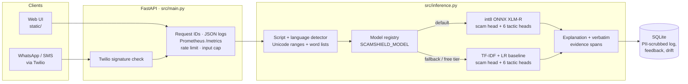
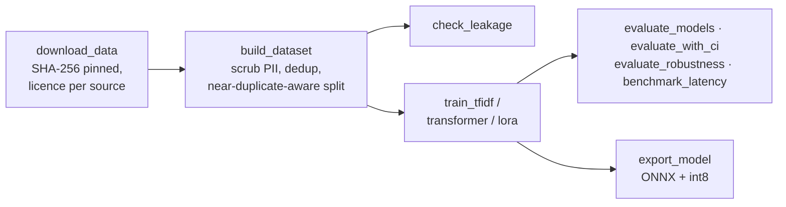

# ScamShield

**Detects payment scams in SMS and WhatsApp messages written in Indian languages, including code-mixed and romanised text such as Hinglish and Tanglish, and explains which manipulation tactic each scam uses.**

**Live demo:** https://scamshield-ai-glhm.onrender.com · **API docs:** https://scamshield-ai-glhm.onrender.com/docs
(free tier: the service sleeps when idle, so the first request can be slow)


[](https://github.com/pavan-dangeti/ScamShield-AI/actions/workflows/ci.yml)
[](LICENSE)

> **Read the results as validation numbers.** They are measured on a held-out split of a
> corpus that is mostly synthetic or of unverified origin. The hand-labelled test set of
> real messages is being labelled now; until it is frozen, no number here measures the
> product on real traffic. See [Limitations](#limitations).

---

## Results at a glance

Validation split (1,554 messages), decision threshold 0.5, unless stated. Each row
comes from a script in this repository; the command regenerates the file the number
is read from.

| Result | Value | Baseline (TF-IDF + logistic regression) | Reproduce |
|---|---|---|---|
| Scam F1, best model (XLM-R + augmentation) | **0.9980** (95% CI 0.995–1.000) | 0.9082 (0.889–0.926) | `python -m scripts.evaluate_with_ci --models tfidf-lr-aug xlmr-base-aug --out results/evaluation_with_ci_aug.json` |
| F1 under character swaps, the attack that hurts the baseline most | **0.993** | 0.863 | `python -m scripts.evaluate_robustness --models tfidf-lr tfidf-lr-aug xlmr-base xlmr-base-aug` |
| CPU latency, one message (int8 ONNX) | **4.44 ms p50** · 278 MB | 0.51 ms · 10 MB | `python -m scripts.benchmark_latency --models tfidf-lr xlmr-aug-int8 --n 200 --device cpu` |
| HTTP throughput, 1 worker, 8 clients (served model) | **823 req/s**, p95 24 ms, 0 errors | — | see [Serving capacity](#serving-capacity) |
| Fine-tuned 135M model vs prompted 7B LLM (354-row subsample) | **F1 0.869** vs 0.726 | — | `python -m scripts.evaluate_models --models llm-0shot llm-3shot lora-SmolLM2-135M-Instruct --subsample 400` |

**Which model is live, and why.** The int8 XLM-R encoder is the most accurate model
that is fast enough to serve, and it is what the API loads by default. The live demo
serves the TF-IDF baseline instead, because a server holding the encoder uses about
1.1 GB of memory and the free tier allows 512 MB. `GET /api/health` reports the model
that is actually serving. `SCAMSHIELD_MODEL` switches between them.

---

## How it works



1. **Script and language.** Unicode ranges identify native scripts (Devanagari, Tamil,
   Telugu, Bengali and five more). Romanised code-mixing is identified by exact matches
   against each language pack's word list.
2. **Decision and tactics.** One model, two heads: a scam/legitimate head and a
   multi-label head over six tactics (urgency, authority impersonation, false reward,
   loss aversion, credential phishing, suspicious link), so the explanation is
   consistent with the decision.
3. **Explanation.** Each tactic is explained in plain language with the phrase that
   triggered it, quoted **only if it appears verbatim in the message**. The neural
   model has no per-token weights, so it says "suspicious phrasing" rather than
   inventing a quote.
4. **Logging.** Every analysis is logged to SQLite with phone numbers, emails, UPI
   handles and long identifiers scrubbed, and feeds the dashboard, user corrections
   and score-drift monitoring. If the database fails, the user still gets an answer.

Offline, separate from the request path:



Design decisions, alternatives and risks: [`docs/design.md`](docs/design.md).

---

## Model comparison

All models see the same split at the same threshold
(`python -m scripts.evaluate_models --models tfidf-lr tfidf-lr-aug indicbertv2-mlm xlmr-base xlmr-base-aug`,
written to `results/model_comparison.md`). Latency is CPU, one message at a time
(`results/latency.json`).

| Model | Precision | Recall | F1 | ROC-AUC | Tactic macro-F1 | CPU p50 | Size |
|---|---|---|---|---|---|---|---|
| TF-IDF + LR (baseline) | 0.8522 | 0.9722 | 0.9082 | 0.9892 | 0.8254 | 0.51 ms | 10.2 MB |
| TF-IDF + LR, augmented | 0.8589 | 0.9901 | 0.9198 | 0.9884 | 0.8891 | 0.52 ms | 16.6 MB |
| IndicBERTv2, fine-tuned | 0.9980 | 0.9881 | 0.9930 | 1.0000 | 0.9621 | 11.73 ms | 1120 MB |
| XLM-R base, fine-tuned | 0.9941 | 1.0000 | 0.9970 | 0.9999 | 0.9267 | 11.71 ms | 1129 MB |
| **XLM-R base, augmented** | 0.9960 | 1.0000 | **0.9980** | 0.9996 | **0.9871** | 4.44 ms (int8 ONNX) | 278 MB |

**LLMs** — same 354-row seeded subsample for every row, because generation is slow
(`results/model_comparison_subsample400.md`):

| Model | Precision | Recall | F1 | Tactic macro-F1 |
|---|---|---|---|---|
| Qwen2.5-7B-Instruct (4-bit), zero-shot | 0.5329 | 0.9889 | 0.6926 | 0.0919 |
| Qwen2.5-7B-Instruct (4-bit), 3-shot | 0.5696 | 1.0000 | 0.7258 | 0.4030 |
| SmolLM2-135M + LoRA (r=16, 1 epoch) | 0.9597 | 0.7944 | 0.8693 | 0.1822 |

The prompted 7B model calls almost everything a scam: it learns the topic of fraud
detection, not the decision boundary. Fine-tuning a model 50× smaller fixes that,
because the label it is trained to emit carries the corpus prior. Prompting costs
about $0.004 and 60 minutes per 1,000 messages on a laptop, or $0.14 per 1,000 through
an API at $0.30 per million tokens (`python -m scripts.llm_cost --shots 3`).

**Calibration and threshold.** XLM-R + augmentation has a Brier score of 0.0010 and
expected calibration error 0.0016; the baseline 0.0495 and 0.0631
(`results/evaluation_with_ci*.json`). Counting a missed scam as 10× the cost of a false
alarm, the cost-optimal threshold is **0.30** for the baseline (best-F1 is 0.45), and
0.75 for XLM-R + augmentation, where it coincides with best-F1. Full sweep and method:
[`docs/model_comparison.md`](docs/model_comparison.md).

**The weak spot the aggregate hides.** On Bengali in native script (192 rows) the
baseline scores F1 0.652 at precision 0.48: it flags most legitimate Bengali messages
as scams. The encoders score 1.0 on the same cell.

---

## Robustness

A scam filter is attacked by construction. Six perturbation families, applied to the
validation split (`results/robustness.md`; method in [`docs/robustness.md`](docs/robustness.md)):

| Model | Clean F1 | Character swaps | Look-alike letters | Spacing tricks | Mean flip rate |
|---|---|---|---|---|---|
| TF-IDF + LR | 0.9082 | 0.863 (−0.045) | 0.884 (−0.024) | 0.886 (−0.022) | 0.017 |
| TF-IDF + LR, augmented | 0.9198 | 0.902 (−0.018) | 0.909 (−0.011) | 0.911 (−0.009) | 0.008 |
| XLM-R base | 0.9970 | 0.964 (−0.033) | 0.977 (−0.020) | 0.971 (−0.026) | 0.011 |
| **XLM-R base, augmented** | **0.9980** | **0.993 (−0.005)** | 0.986 (−0.012) | 0.985 (−0.013) | **0.003** |

Transliteration drift, emoji insertion and disguised links cost every model at most
0.009 F1. Training on perturbed text made both models more robust and slightly more
accurate on clean text, at no extra latency; the augmented baseline's artefact grows
from 10.2 to 16.6 MB.

---

## Serving capacity

HTTP load test against a local server, load generator on the same 10-core arm64
machine, so these are lower bounds for the server alone. Each file records the exact
server and load commands.

| Configuration | Clients | Req/s | p50 | p95 | Errors | Report |
|---|---|---|---|---|---|---|
| TF-IDF, 1 worker | 8 | 823 | 4.6 ms | 23.9 ms | 0% | `results/load_test_http_tfidf_w1.md` |
| TF-IDF, 4 workers | 8 | 1,250 | 3.2 ms | 21.3 ms | 0% | `results/load_test_http_tfidf_w4.md` |
| int8 XLM-R, 1 worker | 8 | 388 | 19.3 ms | 33.6 ms | 0% | `results/load_test_http_onnx_w1.md` |

```bash
RATE_LIMIT_PER_MINUTE=1000000 SCAMSHIELD_MODEL=tfidf-lr uvicorn src.main:app --port 8000 --workers 1
python -m scripts.load_test --serve --url http://127.0.0.1:8000/api/analyze --n 3000 --concurrency 1 8 32
```

Profiling under load found the baseline vectorising every message seven times and
rebuilding its vocabulary for every quoted evidence span; fixing both took a single
worker from 161 to 823 req/s with identical predictions. Inference is CPU-bound, so
throughput scales with worker processes, not threads, and batching *lowers* encoder
throughput on CPU (178 msg/s one at a time, 91 msg/s in batches of 32) because every
message is padded to the longest.

**Failure handling** is tested by breaking each dependency on purpose
(`tests/test_api.py`): a crashing model returns a generic 500 with a request ID and
logs the cause; a missing or corrupt model file falls back to the baseline; a database
outage still returns the analysis; oversized input is a 422; a forged Twilio signature
is a 403; a model failure inside the WhatsApp webhook still answers Twilio with valid
TwiML, so Twilio does not retry. **Observability:** JSON logs carrying a request ID
(never the message text), and Prometheus metrics at `/metrics`, including the live
score histogram used for drift monitoring (`python -m scripts.monitor_drift`).

---

## Data

| Provenance | Rows | Source | Used for |
|---|---|---|---|
| Real | 4,904 | UCI SMS Spam Collection (English, CC BY 4.0) | training, validation, test candidates |
| Unverified | 6,855 | Bengali SMS smishing corpus (collection method not stated) | training, validation |
| Template | 2,180 | language packs in `data/language_packs/`, expanded | training, validation |
| Synthetic | 1,538 | LLM-generated, quality-gated, always marked | training only, never test |

15,477 rows after PII scrubbing and de-duplication: 13,923 train and 1,554 validation,
split so that near-duplicates never cross splits (`python -m scripts.check_leakage`
proves it). Datasets are downloaded by script and pinned by SHA-256, never committed.
Licences, provenance and known biases: [`docs/data_card.md`](docs/data_card.md),
[`docs/data_sources.md`](docs/data_sources.md).

**The hand-verified test set** contains real messages only, is labelled blind against
written guidelines ([`docs/labeling_guidelines.md`](docs/labeling_guidelines.md)) in a
keyboard-driven tool, and reports its own label quality: self-agreement against a blind
re-check, and agreement with the original UCI annotation. 189 English candidates are
being labelled. There is no public real corpus for Hindi, Tamil, Telugu or Bengali, so
those cells depend on contributed messages
(`python -m scripts.import_user_messages --input messages.csv`).

---

## Run it locally

```bash
git clone https://github.com/pavan-dangeti/ScamShield-AI.git && cd ScamShield-AI
python -m venv .venv && source .venv/bin/activate
pip install -r requirements-dev.txt
cp .env.example .env

python -m scripts.download_data     # fetch sources, SHA-256 pinned
python -m scripts.build_dataset     # scrub, de-duplicate, split
python -m scripts.train_tfidf       # baseline model, about two minutes
SCAMSHIELD_MODEL=tfidf-lr python -m src.main   # http://127.0.0.1:8000
```

Checks, as CI runs them: `pytest tests/ -q`, `ruff check src scripts tests`,
`vulture src scripts tests --min-confidence 80`,
`mypy --explicit-package-bases --namespace-packages src scripts tests`.

Neural models: `pip install -r requirements-ml.txt`, then the commands in
[`docs/model_comparison.md`](docs/model_comparison.md), or the free-GPU notebook
[`notebooks/train_encoder_colab.ipynb`](notebooks/train_encoder_colab.ipynb). The int8
model is produced by `python -m scripts.export_model --model xlmr-base-aug --quantize`.
WhatsApp: [`docs/twilio_setup.md`](docs/twilio_setup.md). New language, no code change
for a script the detector already knows: [`docs/adding_a_language.md`](docs/adding_a_language.md).
The demo GIF is recorded by `python -m scripts.record_demo`.

| Endpoint | Method | Purpose |
|---|---|---|
| `/api/analyze` | POST | `{"text": …}` → probability, label, language and script, tactics with evidence, explanation |
| `/api/sms-webhook` | POST | Twilio webhook for WhatsApp/SMS; replies with TwiML |
| `/api/feedback` | POST | Record a user's correction for an analysed message |
| `/api/stats` | GET | Dashboard aggregates |
| `/api/health` | GET | Liveness and the model actually serving |
| `/metrics` | GET | Prometheus metrics |

| WhatsApp | API docs |
|---|---|
|  |  |

---

## Limitations

These are the limitations the measurements show, not a wish list.

1. **Every accuracy number is a validation number.** The real-message test set is not
   frozen yet. Near-perfect validation F1 for the encoders on a corpus built partly from
   templates should be read as "learned this corpus", not "solved the problem".
2. **The corpus is mostly synthetic or of unverified origin.** Only 4,904 rows are real
   and labelled with a known collection method, and they are English messages from the
   UK, 2004–2011. Expect over-flagging of legitimate Indian marketing the model has not seen.
3. **Bengali is 37% of the corpus**, from a source that does not state how it was
   collected, so per-language results over-represent it. Tamil and Telugu cells are small
   enough that their individual numbers mean little.
4. **Tactic labels are template-derived**, so tactic metrics measure recognition of
   template families. Evidence spans from the baseline can be weak (a number, a fragment
   of a link), and the neural model cannot quote evidence at all.
5. **Explanations are English only**, whatever the message's language.
6. **Language detection is a word list**, so romanised text with few listed words is
   reported as English.
7. **Robustness covers six static attack families.** No adaptive attack that searches
   against the model was run.
8. **The live demo serves the baseline**, the weaker model, because of free-tier memory.
   Its dashboard resets when the service restarts.
9. **One labeller.** The test set's label quality is measured against a blind re-check
   and the UCI annotation, not against a second person.

## Documentation

[`docs/design.md`](docs/design.md) design and trade-offs ·
[`docs/model_card.md`](docs/model_card.md) ·
[`docs/data_card.md`](docs/data_card.md) ·
[`docs/model_comparison.md`](docs/model_comparison.md) ·
[`docs/robustness.md`](docs/robustness.md) ·
[`docs/labeling_guidelines.md`](docs/labeling_guidelines.md)

## License

MIT
